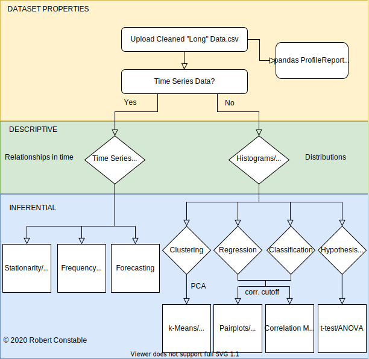
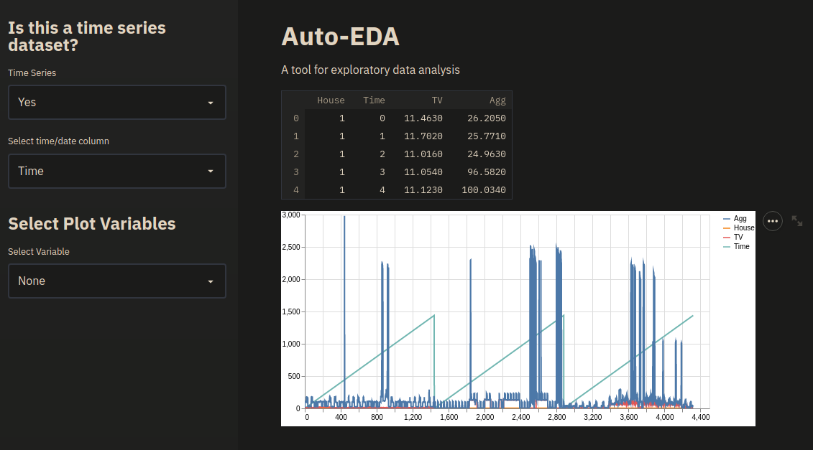

## Auto EDA 
### A web app for easy exploratory data analysis

### Purpose

The purpose of this tool is to provide a workflow for exploratory data analysis, offering a stripped down pipeline of plots and statistical tests, that one would likely apply to a cleaned dataset. The aim here is not to offer a comprehensive suite of EDA tools but rather a minimal set of tools, applicable to most datasets and learning objectives involving tabular data.         

### Approach

The tool takes the user on a trip down a decision tree of plots and statistical analyses. The path taken depends on the nature of your dataset and your learning objective. As I build out the app, I want to progressively add the functionality shown in the diagram below:

<!--  -->

### Design

Using the options in the sidebar, you can select the variable you want to visualise and run analyses on, subset data, set cutoffs and bin sizes and specify the analyses you want to apply to your data. You can then copy the tables and figures generated into your report.

